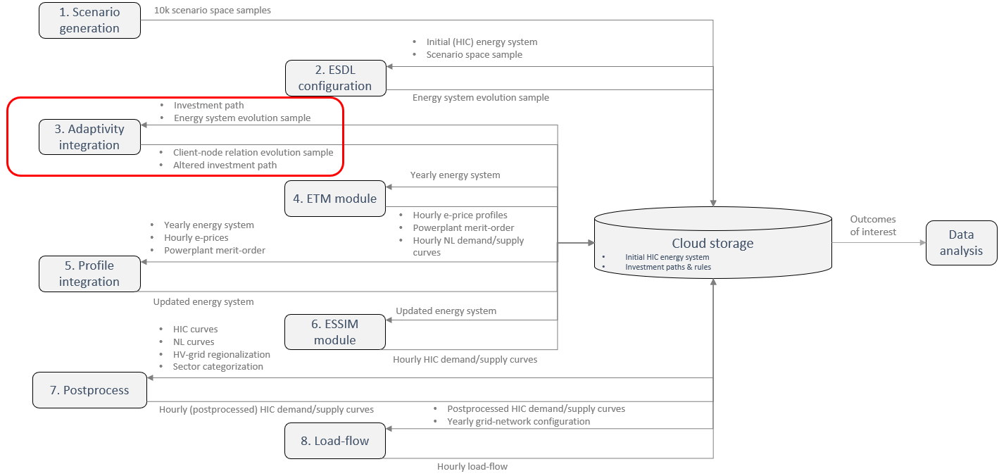

# Gridmaster Initialization

## Description

This repository contains the 'Adaptivity integration' module that initializes an existing bucket with customer-node relations and investment path information, including investment costs, station capacities and networkIDs, as shown in the schematic overview below (for a more elaborate description of the figure see the 'gridmaster-event-chain' repository). This repository contains all the Python scripts and data required for execution of the module. Due to confidentiality, some data was removed. Therefore, this repository will not run out of the box.

This module computes the customer-node relations, station capacities, investment costs and grid topology based on the scenario events in a specific reference year. This operation is executed for three different networks; The high-voltage, medium-voltage and gas -grid. Both the operations for high-voltage and gas -grid are based on a method in which only the computation and selection of the customer-node relations and networkIDs are based on an adaptive approach. All operations for the medium-voltage grid are based upon an adaptive approach. All data is stored by creating the required subfolders as shown below:

    .
    ├── scenarioID
        ├── scenarioYear
        │   └── gasunieInvestmentModels
        │        └── networkModel
        │            ├── essim_hsites.csv.gz
        │            └── essim_msites.csv.gz
        ├────── tennetInvestmentModels
        │        └── investmentPath
        │            └── essim_sites.csv.gz
        ├────── stedinDesigns
        │        └── investmentRule
        │            ├── essim_sites.csv.gz
        │            ├── investment_database.csv.gz
        │            └── essim_substations.csv.gz
        └────── scenario_json.json

## Required input

DISCLAIMER: All confidential data has been removed from the files. These files only contain data based upon public available information and/or educated assumptions.

- **hic_description_final.xlsx:** This file contains the description of the initial energy system and investment paths.
- **base.esdl:** This file contains the energy system description in ESDL format.
- **investments_investments_model_mapping.csv:** This file contains the building blocks of the investment paths for the HV grid.

For a more elaborate description of the method and detailed narratives on the module refer to the Gridmaster report that can be found on the [Gridmaster website](https://gridmaster.nl/).

## Other Gridmaster tooling

The public results of the multi-model simulations are published with Tableau and can be accessed through the following link: [Access visualization tool](https://public.tableau.com/app/profile/gridmaster2022)
